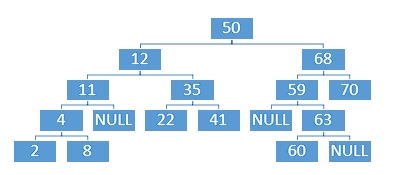

# TDA ABB

## Repositorio de Abril Luna Gimenez - 106278 - algimenez@fi.uba.ar

- Para compilar:

```bash
make ejemplo
```

- Para ejecutar:

```bash
./ejemplo
```

- Para ejecutar con valgrind:
```bash
make valgrind-chanutron
```
---
##  Funcionamiento

El programa desarrolla las funciones necesarias para trabajar con un arbol binario. Crearlo, agregar elementos, buscarlos, quitarlos, etc.
Permite al usuario conocer el tamanio del arbol, su raiz, si el mismo esta vacio, guardar elementos del mismo en un array y recorrerlo.
En el archivo `abb.c` la función `abb_crear` utiliza `calloc` para reservar la memoria necesaria para un arbol e inicializar arbol->nodo_raiz y arbol->tamanio.
El programa luego de usar `calloc` verifica que se haya reservado la memoria correctamente, en caso contrario maneja el error, retornando NULL por ej.

La funcion `insertar_nodo_rec` tabaja recursivamente hasta encontrar el lugar correspondiente para el nodo a insertar, según el elemento enviado. Si el elemento es menor al que esta almacenado en la raiz del arbol, vulve a invocarse pero con el hijo izquierdo del mismo y si esta vacio inserta ele elmento, de lo contrario, prueba con el hijo derecho. Repite el mismo procedimiento con el nodo recibido, alternando entre hijo izquiero o derecho, según corresponda hasta poder insertar el elemento.

La funcion `buscar_nodo_rec` trabaja recursivamente hasta encontrar el nodo que contiene un elemento igual al enviado, compara el elemento del nodo recibido con el elemento que se esta bucando y según la comparación, retorna nodo->elemento o la funcion pero avanzando en el abb hacia izquierda o derecha(según corresponda), de no encontrarlo devuelve NULL.

Utilicé funciones recurcivas porque son útiles en estos casos en los que de debe realizar la misma acción y comparación con cada nodo al que se avanza.

Para `quitar_nodo_rec` encontre una mayor dificultad al implementarla, ya que al encontrar el nodo que contiene elemento a eliminar debia reemplazar el mismo por su predecesor. Para esto, cree `buscar_predecesor`, con un auxiliar intercambié de lugar los elementos y luego rellamo a la función `quitar_nodo_rec` pero en la rama izquierda del elemento a eliminar, con la finalidad de eliminar el nodo_predecesor(que ahora contiene el elemento a eliminar). 

Las funciones de recorrido también las planteé recursivamente, en el caso de `abb_recorrer_inorden` por ej, la condición de corte es que se haya llenado el array, ahora que releo el .c para hacer el informe, noto que el if a continuación podría estar de más, ya que tiene la condicion de corte al inicio de la función. por otro lado, tengo miedo de modificarlo y romper todo el programa.

```c
	if ((*nodos_guardados) < tamanio) {
		array[*nodos_guardados] = nodo->elemento;
		(*nodos_guardados)++;
	}
```
En el archivo `pruebas_alumno.c` se crea un arbol y se prueban las funciones de `abb.c`
En algunos casos evite usar las funciones, para demostrar que entiendo la lógica de donde deberian quedar posicionados los elementos.
Adjunto 2 graficos del árbol al comienzo y el árbol al finalizar las variadas pruebas.

<div align="center">

</div>

<div align="center">

</div>

---

## Respuestas a las preguntas teóricas
Incluír acá las respuestas a las preguntas del enunciado (si aplica).
